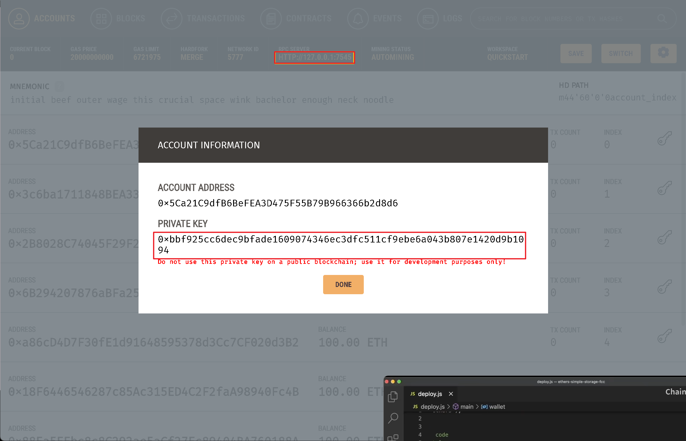
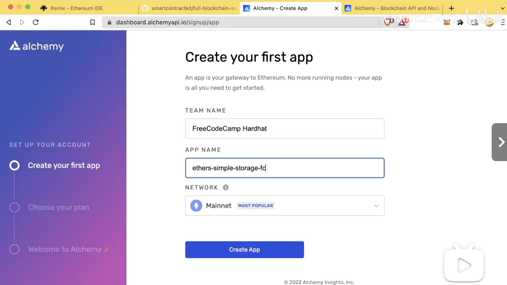
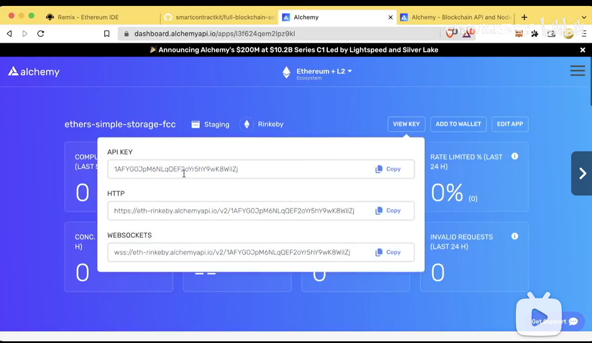
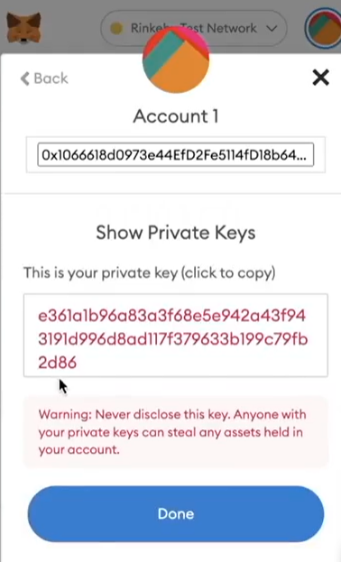

### nodejs

`node deploy.js`

### json文件必备

```json
async function main() {
    console.log("hello world")
}
main()
    .then(() => process.exit(0))
    .catch((error) => {
        console.error(error)
        process.exit(1)
    })
```

这段代码是一个 JavaScript 的 Promise 处理示例。具体意思如下：

1. `main()` 是一个返回 Promise 的函数。
2. `then()` 方法会在 `main()` 执行成功时被调用，执行成功后会调用 `process.exit(0)`，表示程序正常退出。
3. `catch()` 方法会在 `main()` 执行失败时被调用，如果发生错误，会打印错误信息 `console.error(error)`，然后调用 `process.exit(1)`，表示程序以错误状态退出。

总的来说，这段代码用于执行 `main()` 函数，并根据其执行结果决定程序的退出状态。

### prettier

同时安装`prettier` 和`prettier-plugin-solidity`

`yarn install --save-dev prettier prettier-plugin-solidity`

```js
// .prettierrc
{
  "tabWidth": 4,
  "useTabs": false,
  "semi": false,
  "singleQuote": false
}
```

```js
// .prettierignore
node_modules
package.json
img
```

### 异步编程

[JavaScript 异步编程 | 菜鸟教程](https://www.runoob.com/js/js-async.html)

[JavaScript Promise | 菜鸟教程](https://www.runoob.com/js/js-promise.html)

### solc

使用 `npm` 可以便捷地安装 `solcjs` ，它一个 Solidity 编译器。

```shell
npm install -g solc
```

利用``solc`生成`abi`和`bin`文件

```shell
yarn solcjs --bin --abi --include-path node_modules/ --base-path . -o . SimpleStorage.sol
```

为简化代码，我们将此语句加入`package.json`中成为脚本，

以后可以通过`yarn compile`来编译代码

```json
// package.json
{
  "name": "ethers-simple-storage-fcc",
  "version": "1.0.0",
  "description": "",
  "dependencies": {
    "dotenv": "^14.2.0",
    "ethers": "^6.2.3",
    "prettier": "^2.5.1",
    "solc": "0.8.7-fixed"
  },
  "scripts": {
    "compile": "solcjs --bin --abi --include-path node_modules/ --base-path . -o . SimpleStorage.sol"
  }
}

```

## Ganache

Ganache是一个可以在本地模拟以太坊环境的客户端，新手入门时可以使用Ganache进行开发，因为其免费（虚拟的交易）且响应速度快，可以节省大量的开发时间，让开发者更专注业务本身。下载地址：[https://www.trufflesuite.com/ganache](https://kanchuan.com/go?to=https%3A%2F%2Fwww.trufflesuite.com%2Fganache)

下载对应系统的版本安装即可。Ganache很容易上手，可以通过主页面的「QUICKSTART」一键启动一个本地以太坊环境。在设置的SERVER标签页，有RPC服务的地址和端口号，记下来后续会用到。

[Dapp开发利器--Truffle三剑客之Ganache-CSDN博客](https://blog.csdn.net/weixin_39430411/article/details/104248037)

## ethers

ethers.js库旨在为以太坊区块链及其生态系统提供一个小而完整的 JavaScript API 库，它最初是与 [ethers.io](https://ethers.io/) 一起使用，现在已经扩展为更通用的库

`yarn add ethers`

[ethers.js 中文文档](https://learnblockchain.cn/ethers_v5/)

我们需要在deploy.js中导入ethers

`const ethers = require("ethers");`

### 连接本地区块链网络并获取一个钱包

```json
async function main() {
    let provider = new ethers.JsonRpcProvider("http://127.0.0.1:7545")
    let wallet = new ethers.Wallet("0xbbf925cc6dec9bfade1609074346ec3dfc511cf9ebe6a043b807e1420d9b1094", provider)
}
```



### 部署合约

我们已有连接上了本地区块链网络，也拥有了一个钱包，因此我们可以将自己刚刚生成的合约部署到区块链网络上。

我们需要用到刚刚生成的abi和bin。

部署合约需要用到fs包

### fs包

`yarn add fs-extra`

`const fs = require("fs-extra");`

```json
// deploy.js
async function main() {

    let provider = new ethers.JsonRpcProvider(process.env.RPC_URL)
    let wallet = new ethers.Wallet(process.env.PRIVATE_KEY, provider)

    const abi = fs.readFileSync("./SimpleStorage_sol_SimpleStorage.abi", "utf8")
    const binary = fs.readFileSync(
        "./SimpleStorage_sol_SimpleStorage.bin",
        "utf8"
    )
    const contractFactory = new ethers.ContractFactory(abi, binary, wallet)
    console.log("Deploying, please wait...")
    const contract = await contractFactory.deploy() //部署合约
}
```

`ethers.ContractFactory(abi,binary,wallet)`返回用来部署合约的对象，是promise型的，因此可以`await contractFactory.deploy()`其返回类型也是promise

现在你可以部署合约了

`node deploy.js`


### 等待区块

部署合约成功未必代表其能上链，我们需要等待一些区块才可以判断该合约确实上链了

```json
async function main() {

    let provider = new ethers.JsonRpcProvider(process.env.RPC_URL)
    let wallet = new ethers.Wallet(process.env.PRIVATE_KEY, provider)

    const abi = fs.readFileSync("./SimpleStorage_sol_SimpleStorage.abi", "utf8")
    const binary = fs.readFileSync(
        "./SimpleStorage_sol_SimpleStorage.bin",
        "utf8"
    )
    const contractFactory = new ethers.ContractFactory(abi, binary, wallet)
    console.log("Deploying, please wait...")
    const contract = await contractFactory.deploy()
    const deploymentReceipt = await contract.deployTransaction.wait(1) //等待一个区块
    console.log(`Contract deployed to ${contract.address}`)
    // console.log("Here is the transaction:")
    // console.log(contract.deployTransaction)
    // console.log("Here is the receipt:")
    // console.log(deploymentReceipt)
}
```

### 手动添加交易过程（有助于理解提交交易的整个过程）

```json
async function main() {

    let provider = new ethers.JsonRpcProvider(process.env.RPC_URL)
    let wallet = new ethers.Wallet(process.env.PRIVATE_KEY, provider)

    const abi = fs.readFileSync("./SimpleStorage_sol_SimpleStorage.abi", "utf8")
    const binary = fs.readFileSync(
        "./SimpleStorage_sol_SimpleStorage.bin",
        "utf8"
    )
    const nonce = await wallet.getTransactionCount()
    tx = {
        nonce: nonce,
        gasPrice: 100000000000,
        gasLimit: 1000000,
        to: null,
        value: 0,
        data: "0x608060405234801561001057600080fd5b50610771806100206000396000f3fe608060405234801561001057600080fd5b50600436106100575760003560e01c80632e64cec11461005c5780636057361d1461007a5780636f760f41146100965780638bab8dd5146100b25780639e7a13ad146100e2575b600080fd5b610064610113565b604051610071919061035c565b60405180910390f35b610094600480360381019061008f91906103b7565b61011c565b005b6100b060048036038101906100ab919061052a565b610126565b005b6100cc60048036038101906100c79190610586565b6101b6565b6040516100d9919061035c565b60405180910390f35b6100fc60048036038101906100f791906103b7565b6101e4565b60405161010a929190610657565b60405180910390f35b60008054905090565b8060008190555050565b6001604051806040016040528083815260200184815250908060018154018082558091505060019003906000526020600020906002020160009091909190915060008201518160000155602082015181600101908051906020019061018c9291906102a0565b505050806002836040516101a091906106c3565b9081526020016040518091039020819055505050565b6002818051602081018201805184825260208301602085012081835280955050505050506000915090505481565b600181815481106101f457600080fd5b906000526020600020906002020160009150905080600001549080600101805461021d90610709565b80601f016020809104026020016040519081016040528092919081815260200182805461024990610709565b80156102965780601f1061026b57610100808354040283529160200191610296565b820191906000526020600020905b81548152906001019060200180831161027957829003601f168201915b5050505050905082565b8280546102ac90610709565b90600052602060002090601f0160209004810192826102ce5760008555610315565b82601f106102e757805160ff1916838001178555610315565b82800160010185558215610315579182015b828111156103145782518255916020019190600101906102f9565b5b5090506103229190610326565b5090565b5b8082111561033f576000816000905550600101610327565b5090565b6000819050919050565b61035681610343565b82525050565b6000602082019050610371600083018461034d565b92915050565b6000604051905090565b600080fd5b600080fd5b61039481610343565b811461039f57600080fd5b50565b6000813590506103b18161038b565b92915050565b6000602082840312156103cd576103cc610381565b5b60006103db848285016103a2565b91505092915050565b600080fd5b600080fd5b6000601f19601f8301169050919050565b7f4e487b7100000000000000000000000000000000000000000000000000000000600052604160045260246000fd5b610437826103ee565b810181811067ffffffffffffffff82111715610456576104556103ff565b5b80604052505050565b6000610469610377565b9050610475828261042e565b919050565b600067ffffffffffffffff821115610495576104946103ff565b5b61049e826103ee565b9050602081019050919050565b82818337600083830152505050565b60006104cd6104c88461047a565b61045f565b9050828152602081018484840111156104e9576104e86103e9565b5b6104f48482856104ab565b509392505050565b600082601f830112610511576105106103e4565b5b81356105218482602086016104ba565b91505092915050565b6000806040838503121561054157610540610381565b5b600083013567ffffffffffffffff81111561055f5761055e610386565b5b61056b858286016104fc565b925050602061057c858286016103a2565b9150509250929050565b60006020828403121561059c5761059b610381565b5b600082013567ffffffffffffffff8111156105ba576105b9610386565b5b6105c6848285016104fc565b91505092915050565b600081519050919050565b600082825260208201905092915050565b60005b838110156106095780820151818401526020810190506105ee565b83811115610618576000848401525b50505050565b6000610629826105cf565b61063381856105da565b93506106438185602086016105eb565b61064c816103ee565b840191505092915050565b600060408201905061066c600083018561034d565b818103602083015261067e818461061e565b90509392505050565b600081905092915050565b600061069d826105cf565b6106a78185610687565b93506106b78185602086016105eb565b80840191505092915050565b60006106cf8284610692565b915081905092915050565b7f4e487b7100000000000000000000000000000000000000000000000000000000600052602260045260246000fd5b6000600282049050600182168061072157607f821691505b60208210811415610735576107346106da565b5b5091905056fea2646970667358221220ca0819476698c2f9c7ae9470d72ad13a8d1a180e4b7dbfa054fe8518cec716f964736f6c63430008080033",
        chainId: 1337,
    }
    console.log("Let's deploy another! Please wait...")
    let resp = await wallet.signTransaction(tx)
    const sentTxResponse = await wallet.sendTransaction(tx);
    console.log(resp)
}
```

`wallet.getTransactionCount()`获取nonce，每个新区块都会使nonce+1

`wallet.signTransaction(tx)`对交易进行签名

`wallet.sendTransaction(tx)`发出交易

手动上传交易过于复杂，所以我们以后还是使用现成的函数好了。

### 如何与部署好的合约进行交互

```json
let currentFavoriteNumber = await contract.retrieve()
console.log(`Current Favorite Number: ${currentFavoriteNumber}`)
console.log("Updating favorite number...")
let transactionResponse = await contract.store(7)
let transactionReceipt = await transactionResponse.wait()
currentFavoriteNumber = await contract.retrieve()
console.log(`New Favorite Number: ${currentFavoriteNumber}`)
```

`const contract = await contractFactory.deploy()`返回的contract对象具有合约里的abi，所以可以直接调用来实现和合约的交互

### .env--Environment Variable File

我们将某些环境变量写入.env文件中

```c++
PRIVATE_KEY=11ee3108a03081fe260ecdc106554d09d9d1209bcafd46942b10e02943effc4a
RPC_URL=http://0.0.0.0:8545
```

### Dotenv

Dotenv 是一个零依赖模块，可将环境变量从 `.env` 文件加载到 [`process.env`](https://nodejs.cn/docs/latest/api/process.html#process_process_env) 中。

`yarn add dotenv`

`require("dotenv").config()`

接下来我们就可以使用`process.env.`来使用我们的环境变量了。

```json
const ethers = require("ethers")
// const solc = require("solc")
const fs = require("fs-extra")
require("dotenv").config()

async function main() {
    let provider = new ethers.JsonRpcProvider(process.env.RPC_URL)
    let wallet = new ethers.Wallet(process.env.PRIVATE_KEY, provider)

    const abi = fs.readFileSync("./SimpleStorage_sol_SimpleStorage.abi", "utf8")
    const binary = fs.readFileSync(
        "./SimpleStorage_sol_SimpleStorage.bin",
        "utf8"
    )
    const contractFactory = new ethers.ContractFactory(abi, binary, wallet)
    console.log("Deploying, please wait...")
    const contract = await contractFactory.deploy()
    // const contract = await contractFactory.deploy({ gasPrice: 100000000000 })
    const deploymentReceipt = await contract.deployTransaction.wait(1)
    console.log(`Contract deployed to ${contract.address}`)

    let currentFavoriteNumber = await contract.retrieve()
    console.log(`Current Favorite Number: ${currentFavoriteNumber}`)
    console.log("Updating favorite number...")
    let transactionResponse = await contract.store(7)
    let transactionReceipt = await transactionResponse.wait()
    currentFavoriteNumber = await contract.retrieve()
    console.log(`New Favorite Number: ${currentFavoriteNumber}`)
}

main()
.then(() => process.exit(0))
.catch((error) => {
    console.error(error)
    process.exit(1)
})
```

### .gitgnore

.gitignore 文件是一个纯文本文件，包含了项目中所有指定的文件和文件夹的列表，这些文件和文件夹是 Git 应该忽略和不追踪的。

在 .gitignore 中，你可以通过提及特定文件或文件夹的名称或模式来告诉 Git 只忽略一个文件或一个文件夹。你也可以用同样的方法告诉 Git 忽略多个文件或文件夹。

```log
node_modules
.env
.encryptedKey.json
SimpleStorage_sol_*
.notes.md
```

### 为防止我们粗心上传密钥，我们也可以在命令添加环境变量

`PRIVATE_KEY=your_wallet_key RPC_URL=http://0.0.0.0:8545 node deploy.js`

### 私钥本地加密

未防止在别人登录本机导致密钥泄露，我们可以将钱包的私钥用自己的密码加密，这时候私钥就不会以明文形式呈现

我们先将自己的密码写入.env

```c++
PRIVATE_KEY_PASSWORD=password
```

再运行如下脚本

```json
// encryptKey.js
const ethers = require("ethers")
const fs = require("fs-extra")
require("dotenv").config()

async function main() {
    const wallet = new ethers.Wallet(process.env.PRIVATE_KEY)
    
    const encryptedJsonKey = await wallet.encrypt(
        process.env.PRIVATE_KEY_PASSWORD,
        process.env.PRIVATE_KEY
    )
    // In later version (^6.2.3 as of this commit) of etherjs, PRIVATE_KEY is inferred from wallet, so there is no need to 
    // pass private key again. 
    //     const encryptedJsonKey = await wallet.encrypt(
    //         process.env.PRIVATE_KEY_PASSWORD,
    //  )
    console.log(encryptedJsonKey)
    fs.writeFileSync("./.encryptedKey.json", encryptedJsonKey)
}

main()
    .then(() => process.exit(0))
    .catch((error) => {
        console.error(error)
        process.exit(1)
    })

```

这个脚本可以将我们的钱包私钥进行加密，并存储到`.encryptedKey.json`文件中。

我们即可以在`deploy.js`中解密钱包私钥，并和`provider`连接

```json
    const encryptedJson = fs.readFileSync("./.encryptedKey.json", "utf8");
    let wallet = new ethers.Wallet.fromEncryptedJsonSync(
      encryptedJson,
      process.env.PRIVATE_KEY_PASSWORD
    );
    wallet = wallet.connect(provider);
```

之后我们就可以把.env中的password删除。

以后我们可以用以下脚本运行deploy.js

```shell
PRIVATE_KEY_PASSWORD=password node deploy.js
history -c //记得清除历史记录，防止有人入侵电脑窃取数据
```

[安全开发圣经](https://github.com/smartcontractkit/full-blockchain-solidity-course-js/discussions/5)

### 在测试网和主网上部署合约





在这里我们获得测试网的url



在metamask查看密钥。

并将.env中的网址和密钥替换为这个即可