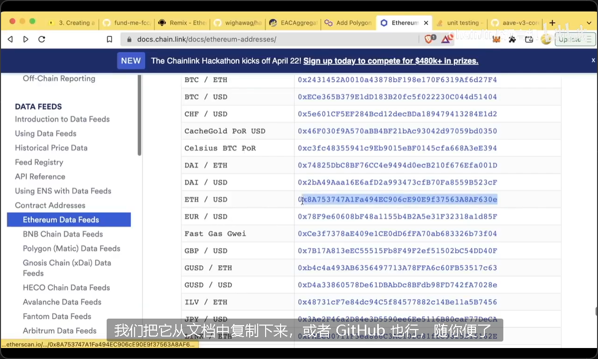

yarn add --dev hardhat

yarn hardhat

### Solhint

Solhint 是一种静态代码分析工具，专门用于分析和检查 Solidity 智能合约的代码质量和安全性。它通过对 Solidity 代码进行语法和风格的检查，帮助开发者遵循最佳实践、提高代码质量，并减少潜在的安全漏洞。

主要功能
代码规范检查：确保代码符合 Solidity 的代码风格标准，例如变量命名、空格、行长等。
安全性检查：识别代码中可能存在的安全问题，如整数溢出、未处理的异常、容易被重入攻击的代码等。
可定制规则：用户可以在配置文件中根据需求定制规则，选择开启或关闭特定的检查项。
自动修复：部分问题支持自动修复功能，使开发者可以快速调整代码。

`npm install -g solhint`

`yarn solhint ./contracts/*.sol`

### prettier

同时安装`prettier` 和`prettier-plugin-solidity`
`yarn add --save-dev prettier prettier-plugin-solidity`

$ npx prettier --write 'contracts/**/*.sol'

```
// .prettierrc
{
    "tabWidth": 4,
    "useTabs": false,
    "singleQuote": false,
    "semi": false,
    "plugins": ["prettier-plugin-solidity"],
    "solidity": "0.8.7"
}

// .prettierignore
node_modules
package.json
img
```

`hardhat-deploy` 是一个专门为 [Hardhat](https://hardhat.org/) 设计的插件，简化了以太坊智能合约的部署过程，适用于 dApp 和智能合约开发者。它提供了结构化的部署脚本体系，使部署过程更易复用和管理，还支持多网络配置和自动处理合约之间的依赖关系。以下是 `hardhat-deploy` 的一些核心功能和优点：

### 主要功能

1. **结构化部署脚本**：`hardhat-deploy` 将部署脚本和任务分离，使用单独的脚本文件（通常放在 `deploy` 文件夹内）。这些脚本采用模块化结构，便于维护和版本控制。

2. **多网络支持**：可以为不同的网络（如本地、测试网、主网）配置不同的部署参数和流程，使迁移和升级更灵活。

3. **合约依赖管理**：支持合约之间的依赖关系，允许定义合约部署的顺序，并在合约部署完成后获取其地址和信息，便于后续交互。

4. **自动保存部署信息**：`hardhat-deploy` 会自动将已部署合约的信息（如地址、ABI 等）保存在 JSON 文件中，便于后续调用和集成。

5. **升级管理**：允许开发者管理不同的合约版本和升级流程，使合约在不同的环境中更易于维护和迁移。

### 安装和使用

要使用 `hardhat-deploy`，首先需要将其添加到项目中：

```bash
npm install --save-dev hardhat-deploy
```

然后在 `hardhat.config.js` 中配置插件：

```javascript
require("hardhat-deploy");
```

测试，那么 `hardhat-deploy` 会是一个非常实用的工具。

我们需要建立 deploy 文件夹，其中放置部署项目的代码

因为要在脚本中使用 ethers，我们建议安装`hardhat-deploy-ethersyarn add`

`yarn add --dev @nomiclabs/hardhat-ethers@npm:hardhat-deploy-ethers ethers`

之后我们就可以运用以下命令去运行 deploy 文件夹下所有文件中导出的函数

`yarn hardhat deploy`

### 01-hardhat-fund-me.js

```json
module.exports = async ({ getNamedAccounts, deployments }) => {
    const { deploy, log } = deployments
    const { deployer } = await getNamedAccounts()
```

```json
namedAccounts: {
    deployer: {
        default: 0, // here this will by default take the first account as deployer
        1: 0, // similarly on mainnet it will take the first account as deployer. Note though that depending on how hardhat network are configured, the account 0 on one network can be different than on another
    },
},
```

通过`getNamedAccounts()`获取 deployer 的账户

### 丰富 FundMe.sol 的 construct 函数

详情查看 7.7 课

```json
// 2. Imports
import "@chainlink/contracts/src/v0.8/interfaces/AggregatorV3Interface.sol"; // 导入Chainlink的价格聚合器接口
import "./PriceConverter.sol"; // 导入自定义的价格转换库
// ...
    AggregatorV3Interface private s_priceFeed; // 链接到Chainlink价格聚合器的接口
// ...
    constructor(address priceFeed) {
        s_priceFeed = AggregatorV3Interface(priceFeed); // 初始化价格聚合器接口
        i_owner = msg.sender; // 设置合约的所有者为部署合约的地址
    }
    function fund() public payable {
        require(
            msg.value.getConversionRate(s_priceFeed) >= MINIMUM_USD,
            "You need to spend more ETH!" // 检查捐款金额是否至少达到最低USD要求
        );
        s_addressToAmountFunded[msg.sender] += msg.value; // 记录捐款金额
        s_funders.push(msg.sender); // 添加捐款者到数组
    }
```



```json
  "devDependencies": {
    "@chainlink/contracts": "^0.3.1",
    "@nomiclabs/hardhat-ethers": "npm:hardhat-deploy-ethers@^0.3.0-beta.13",
    "@nomiclabs/hardhat-etherscan": "^3.0.0",
    "@nomiclabs/hardhat-waffle": "^2.0.2",
    "chai": "^4.3.4",
    "dotenv": "^14.2.0",
    "ethereum-waffle": "^3.4.0",
    "ethers": "^5.5.3",
    "hardhat": "^2.8.3",
    "hardhat-deploy": "^0.9.29",
    "hardhat-gas-reporter": "^1.0.7",
    "prettier-plugin-solidity": "^1.0.0-beta.19",
    "solhint": "^3.3.7",
    "solidity-coverage": "^0.8.13"
  },
```

以下是 `devDependencies` 中每个包在 Hardhat 项目中的用途：

### 1. `@chainlink/contracts`

Chainlink 的官方智能合约库，其中包含预言机合约接口、价格馈送等工具，主要用于和 Chainlink 网络进行交互，例如获取链上数据和价格信息。

### 2. `@nomiclabs/hardhat-ethers`

通过 Ethers.js 库扩展了 Hardhat，使 Hardhat 能够更方便地与以太坊进行交互，包括合约部署、调用方法等。这里通过 `"npm:hardhat-deploy-ethers@^0.3.0-beta.13"` 直接引用 `hardhat-deploy-ethers` 版本，以兼容 `hardhat-deploy` 插件。

### 3. `@nomiclabs/hardhat-etherscan`

用于与 Etherscan 集成，可实现合约部署后的自动验证。通过配置 Etherscan API key，可以使用这个插件自动在 Etherscan 上验证合约源码，简化验证流程。

### 4. `@nomiclabs/hardhat-waffle`

Waffle 是 Ethers.js 和 Hardhat 结合的测试库，提供简便的智能合约测试功能，尤其适合使用 Chai 进行断言测试。这个库允许开发者编写和执行基于 Waffle 的测试。

### 5. `chai`

Chai 是一个断言库，允许开发者编写符合人类可读性且易于理解的测试语句。通常与 Mocha 测试框架一起使用，Hardhat 中也集成了 Chai 来测试合约的行为。

### 6. `dotenv`

Dotenv 是一个环境变量管理库，用来从 `.env` 文件中加载环境变量（例如 API keys、私钥等），保持代码中的敏感信息安全且易于配置。

### 7. `ethereum-waffle`

Waffle 是一个高级的智能合约测试库，包含多种工具和断言，适用于测试 Solidity 合约。结合 `hardhat-waffle` 插件，使得测试和断言合约行为更加简洁。

### 8. `ethers`

Ethers.js 是与以太坊交互的 JavaScript 库，支持合约部署、钱包管理、发送交易等常用功能。Hardhat 使用 `ethers` 提供的功能来与以太坊进行交互。

### 9. `hardhat`

Hardhat 是一个开发框架，用于编写、测试、部署和调试 Solidity 合约。它集成了丰富的插件生态，使合约开发更加高效，并且支持本地开发链模拟、链上数据操作等功能。

### 10. `hardhat-deploy`

Hardhat-deploy 是一个 Hardhat 插件，专注于合约的部署和管理。它允许在多个环境中高效部署合约，并且可以将部署信息保存在 JSON 文件中，以便后续查询和管理。

### 11. `hardhat-gas-reporter`

Gas 报告插件，用于分析和报告每个合约函数的 Gas 消耗情况。它生成详细的 Gas 使用报告，帮助优化智能合约性能。

### 12. `prettier-plugin-solidity`

用于在代码中统一 Solidity 的代码风格。结合 Prettier，可以自动格式化 `.sol` 文件，保持代码的一致性和可读性。

### 13. `solhint`

Solhint 是一个 Solidity 静态分析工具和代码检查器，帮助识别代码中的潜在问题和不良实践，确保合约符合最佳编码规范。

### 14. `solidity-coverage`

用于生成 Solidity 测试覆盖率报告，显示测试中覆盖了多少代码行。帮助开发者了解哪些部分未被测试，从而编写更全面的测试。

### mocks

```c++
const { network } = require("hardhat")

const DECIMALS = "8"
const INITIAL_PRICE = "200000000000" // 2000
module.exports = async ({ getNamedAccounts, deployments }) => {
    const { deploy, log } = deployments
    const { deployer } = await getNamedAccounts()
    const chainId = network.config.chainId
    // If we are on a local development network, we need to deploy mocks!
    if (chainId == 31337) {
        log("Local network detected! Deploying mocks...")
        await deploy("MockV3Aggregator", {
            contract: "MockV3Aggregator",
            from: deployer,
            log: true,
            args: [DECIMALS, INITIAL_PRICE],
        })
        log("Mocks Deployed!")
        log("------------------------------------------------")
        log(
            "You are deploying to a local network, you'll need a local network running to interact"
        )
        log(
            "Please run `npx hardhat console` to interact with the deployed smart contracts!"
        )
        log("------------------------------------------------")
    }
}
module.exports.tags = ["all", "mocks"]

```

这个脚本是用于在本地开发环境中部署一个叫 `MockV3Aggregator` 的“模拟合约”。`MockV3Aggregator` 是 Chainlink 的价格预言机的一个模拟版本，通常用于在本地测试或开发环境中，因为本地环境没有真实的预言机价格数据。

以下是代码的功能说明：

### 1. **常量设置**

```javascript
const DECIMALS = "8";
const INITIAL_PRICE = "200000000000"; // 相当于 2000 美元
```

- `DECIMALS` 和 `INITIAL_PRICE` 用于初始化 `MockV3Aggregator`，模拟一个带有小数点的初始价格值。
- `DECIMALS` 设置价格精度（8 个小数位），`INITIAL_PRICE` 是模拟的初始价格（2000 美元，单位是 8 个小数位的小数形式，即 2000\*10^8）。

### 2. **自动化部署流程**

```javascript
module.exports = async ({ getNamedAccounts, deployments }) => {
    const { deploy, log } = deployments;
    const { deployer } = await getNamedAccounts();
    const chainId = network.config.chainId;
```

- `deployments` 和 `getNamedAccounts` 是 Hardhat 的 `hardhat-deploy` 插件提供的工具，用于自动化合约部署。
- `deploy` 用于部署合约，`log` 用于打印部署过程中的日志信息。
- `deployer` 是部署合约的账户地址，`chainId` 是当前网络的 ID，31337 是本地 Hardhat 网络的默认 chain ID。

### 3. **检测网络并部署模拟合约**

```javascript
if (chainId == 31337) {
    log("Local network detected! Deploying mocks...");
    await deploy("MockV3Aggregator", {
        contract: "MockV3Aggregator",
        from: deployer,
        log: true,
        args: [DECIMALS, INITIAL_PRICE],
    });
    log("Mocks Deployed!");
```

- 代码检查 `chainId` 是否为 31337（即本地网络），如果是，就会在本地网络上部署 `MockV3Aggregator`。
- `deploy` 函数会在 `deployments` 文件夹中创建或更新 `MockV3Aggregator` 的部署信息，方便合约调用。
- `args` 参数用于传入 `MockV3Aggregator` 合约的构造函数。

### 4. **打印提示信息**

```javascript
log(
  "You are deploying to a local network, you'll need a local network running to interact"
);
log(
  "Please run `npx hardhat console` to interact with the deployed smart contracts!"
);
```

- 提示用户在本地网络运行时如何与模拟合约进行交互，方便测试和调试。

### 5. **模块标签**

```javascript
module.exports.tags = ["all", "mocks"];
```

- `tags` 标签用于在部署时可以选择性地运行特定的脚本，使用 `--tags` 参数运行时，可以方便地只部署带有 `mocks` 标签的脚本，比如 `npx hardhat deploy --tags mocks`。

### 总结

这个脚本的作用是在本地网络上部署一个 Chainlink 价格预言机的模拟合约，以便在没有实际预言机数据的情况下进行开发和测试。
